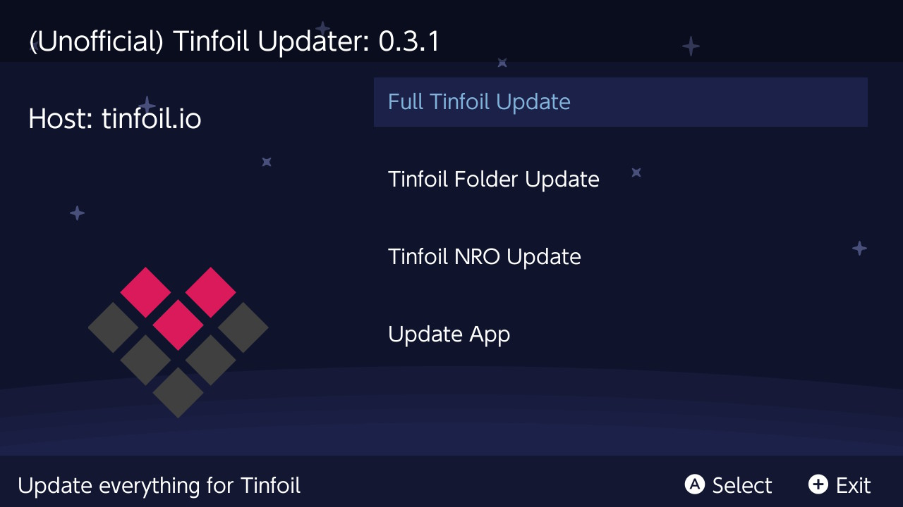
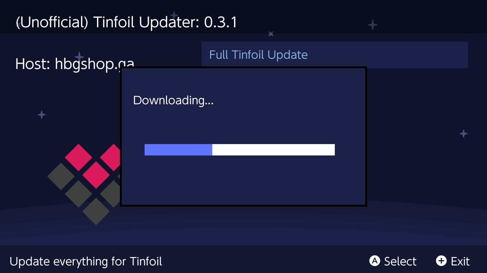
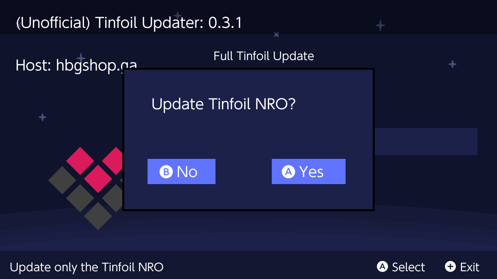
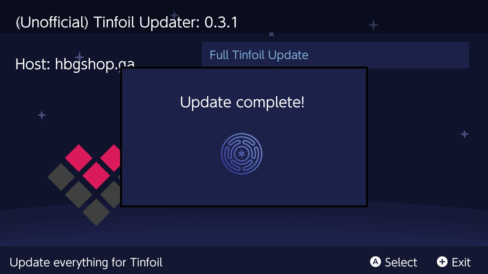
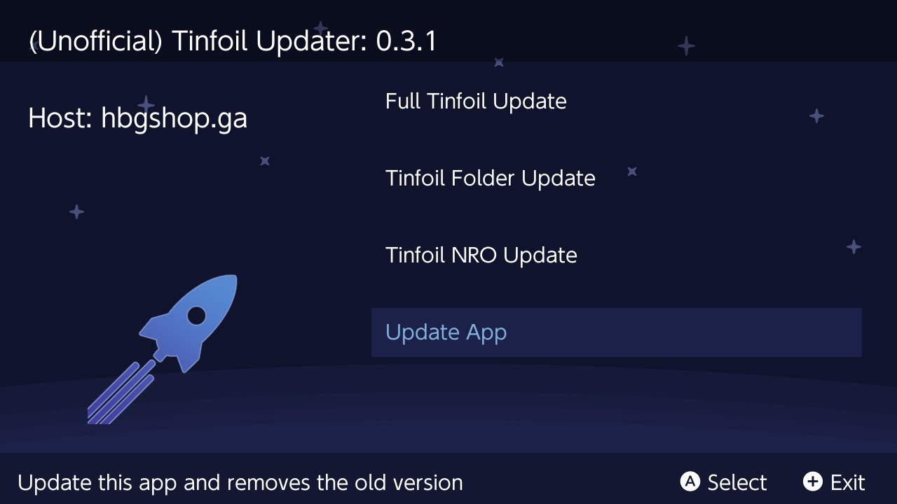

# Tinfoil-Updater

Update Tinfoil from within your switch!

----

# Install

Download the the latest release from [here](https://github.com/JackInTheShop/atmosphere-updater/releases).

Move the downloaded .nro onto you nintendo switch sd card inside the folder **/switch/tinfoil-updater**.

That's it!

----

# Usage

__**The app currently has 4 options.**__

**Full Tinfoil Update:**

* Downloads the latest Tinfoil release and installs everything from that release.

**Update Tinfoil Folder:**

* Downloads the latest Tinfoil release and only updates the `/switch/tinfoil` folder.

**Update Tinfoil NRO:**

* This will only update Tinfoil itself.

**Update App:**

* Downloads the latest version of this app straight from github!
* Deletes the previous old version.

----

# Screenshots

**Menu**

**Download Progress**

**Update the Tinfoil NRO**

**Completed Update**

**Update the App**

----

# Special Thanks!

[ITotalJustice](https://github.com/ITotalJustice) for coding everything in this app! I just added the GUI.

[toph](https://github.com/sudot0ph) for the design of the app icon, as well as the most icons used within the app!

[Black Rabbit](https://github.com/BlackRabbit22) for the design of the plus and error icon (and the idea for this app)!

[bandithedoge](https://github.com/bandithedoge) for the background!

[KrankRival](https://github.com/KranKRival) for the initial sys / ams version pr (and for motivating me to work on touch controls)!

----

# Patreon

Feel free to support ITotalJustice on patreon, he would really appreciate it!

